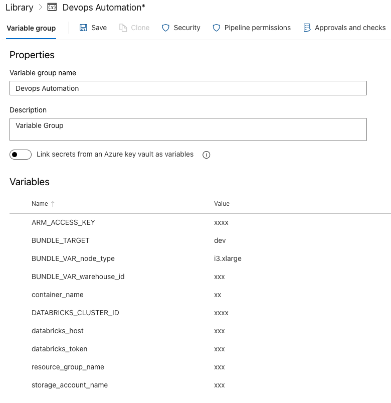

## Set up Azure Devops project and pipeline


To deploy the code via an Azure cicd pipeline, go to your org in azure devops and generate a personal access token.


eg org URL: https://dev.azure.com/kiransreekumar/

click on the user settings icon on the top right and personal access tokens.

New token -> Give a name and expiration and choose a scope.Make a note of the token and save it securely.
Generate an SSh public key from your laptop. 

```ssh-keygen -t rsa```

Copy the generated public key from the generated file and add it to the user settings -> SSH Public Keys in azure devops.


Add the below environment variables

```
export AZDO_ORG_SERVICE_URL=https://dev.azure.com/<your azure devops org name>
export AZDO_PERSONAL_ACCESS_TOKEN=<add your azure devops token>
```

### Install azure cli 

[For mac](https://learn.microsoft.com/en-us/cli/azure/install-azure-cli-macos) 


- brew update 
- brew install azure-cli


Login to the azure account from cli

```az login```


run terraform commands to create the devops pipeline.

```
cd terraform/modules/azuredevops
terraform plan
terraform apply
```
 
This will create  an azure devops pipeline , a variable group and storage account for terraform backend.


 
 
Outputs from Terraform.


```
Container_Name = "statestore"
Resource_Group_Name = "<username>arg"
Storage_Account_Name = "<username>asa"
storage_account_primary_access_key = "<your key>"
```


Update the variable group with the required properties.



Fork the repo and update the properties in terraform/modules/workflows/auth.tf from the output of the terrfaform apply command and merge to main branch.


```
resource_group_name  = "<your resource group name>"
storage_account_name = "<your storage account name>"
container_name       = "<your container name>"

```
