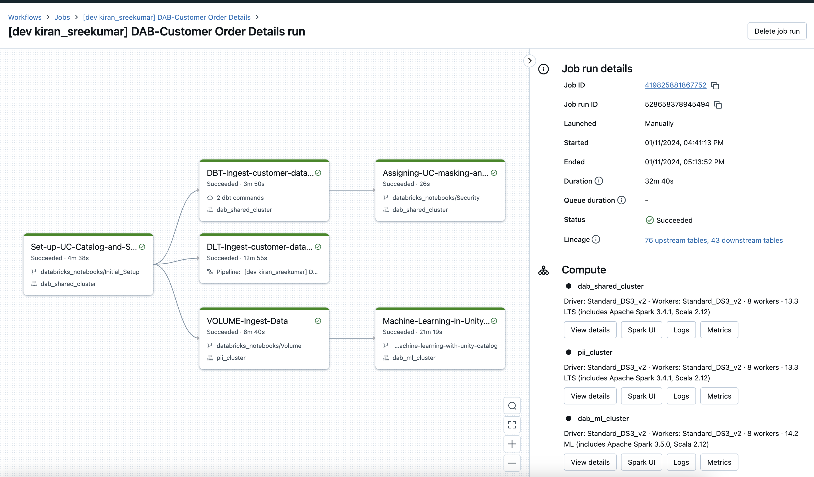

# Workflows Atomation using DAB,Terraform,API and CI/CD integration with Azure devops and github actions

The repo deploys multiple jobs into the Databricks workspace configured using ([Databricks Asset Bundles](https://docs.databricks.com/en/dev-tools/bundles/index.html)) and ([Terraform](https://registry.terraform.io/providers/databricks/databricks/latest/docs))  .

* Set-up-UC-Catalog-and-Schema - This job creates catalog in unity catalog, schemas inside the catalog

* DBT-Ingest-customer-data-and-transformation - This is a DBT job which ingests and transforms TPC-H on DBSQL 

* DLT-Ingest-customer-data-and-transformation - This is an equivalent implementation of the DBT transformation using Delta Live tables

* VOLUME-Ingest-Data - This job creates datasets in volume for use by the machine learning job

* Machine-Learning-in-Unitycatalog - This job runs a machine learning model against the dataset from volumes and registers the model to unity catalog model registry

* Assigning-UC-masking-and-filtering-funtions - this job creates masking and filtering funtions in unity catalog and assigns them to tables created by the DLT transformation.

 

[Local Environment set up ](localSetup.md)

[Azure Devops Deployment](Azuredevops.md)